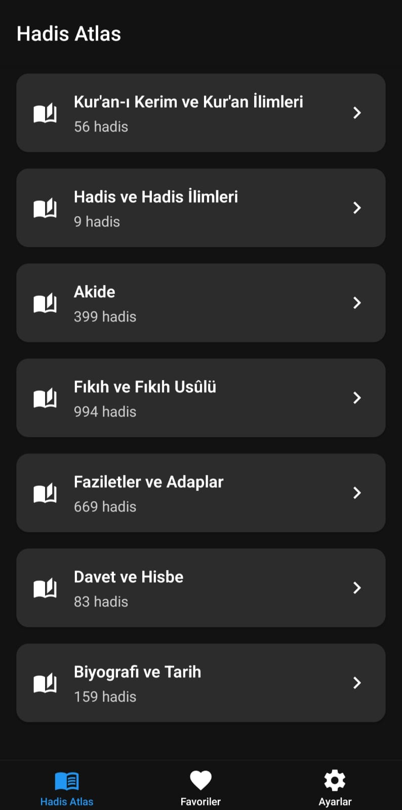
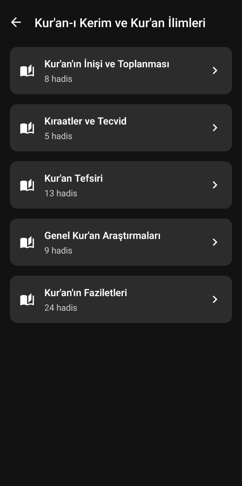
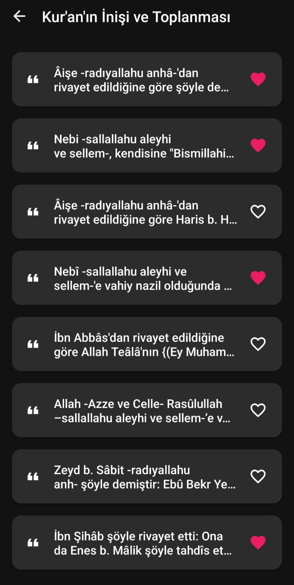
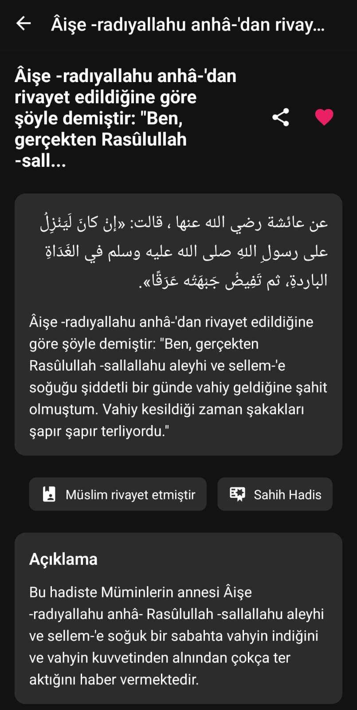
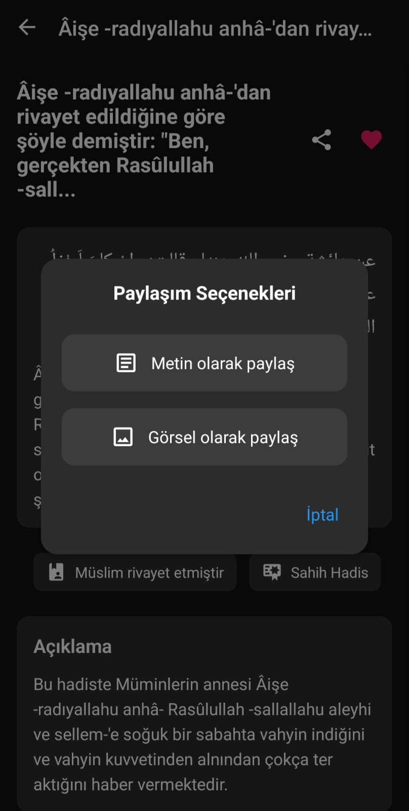
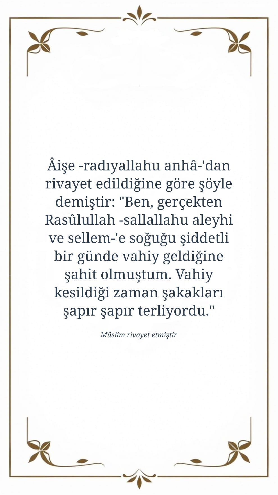
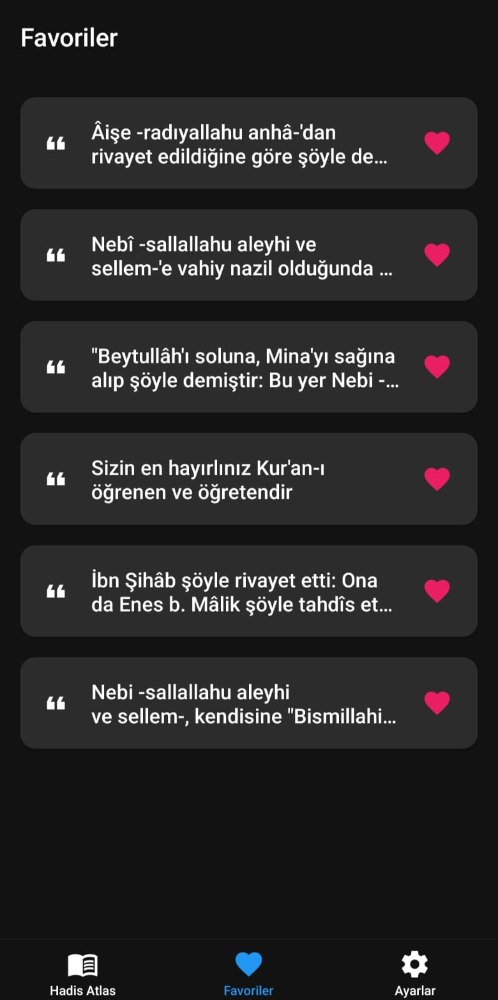
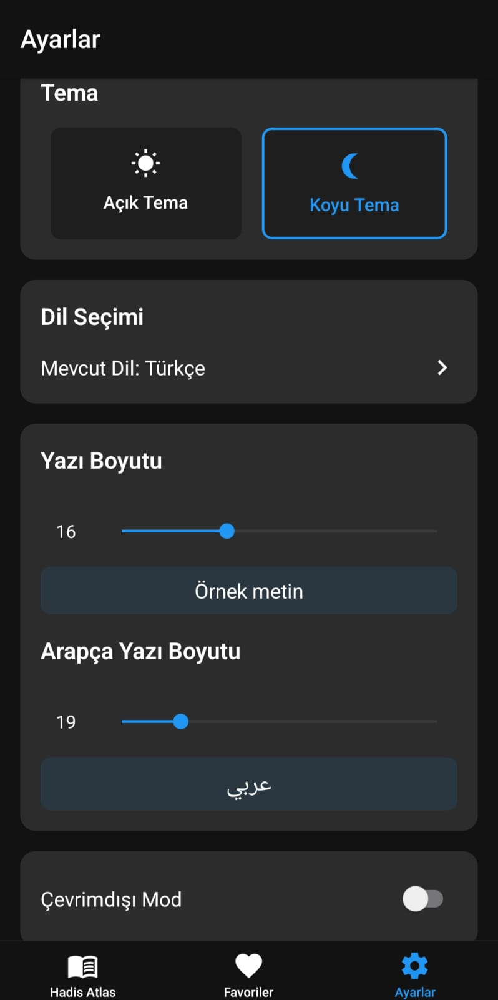

# Hadis Atlas 📱

Hadis Atlas, hadisleri farklı dillerde okuma, kaydetme ve paylaşma imkanı sunan bir mobil uygulamadır. Bu proje VS Code Copilot Agent ile geliştirilmiştir.

## 🛠️ Kullanılan Teknolojiler

- React Native + Expo
- TypeScript
- React Navigation
- AsyncStorage

## 📱 Özellikler

- Hadisleri kategorilere göre listeleme
- Detaylı hadis görüntüleme
- Çoklu dil desteği (Türkçe, İngilizce, Arapça)
- Aydınlık/Karanlık tema desteği
- Çevrimdışı kullanım
- Favori hadisleri kaydetme
- Hadisleri paylaşma (Metin veya Görsel olarak)
- Özelleştirilebilir yazı boyutu

## 📸 Ekran Görüntüleri

  
  
  
  
  
  
  
  

## 🙏 Teşekkür

Bu projenin geliştirilmesinde kullanılan hadis veritabanını ücretsiz sağladıkları için [hadeethenc.com](https://hadeethenc.com)'a teşekkür ederiz.
